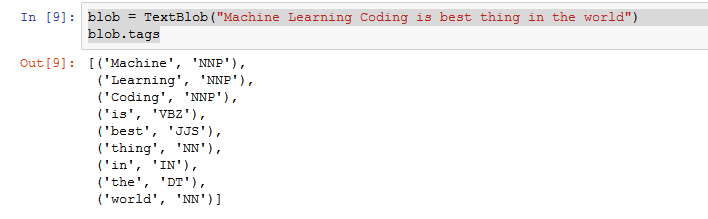
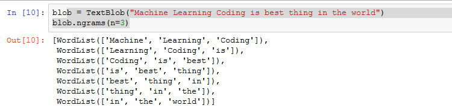
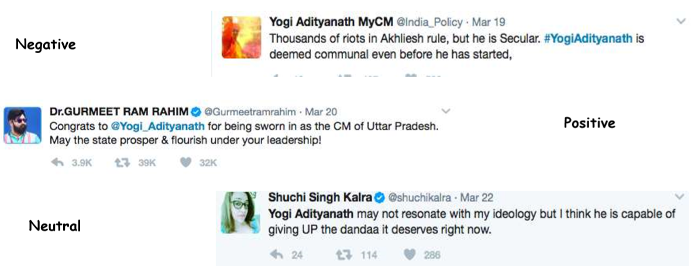
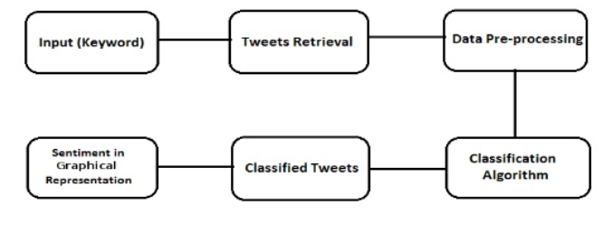
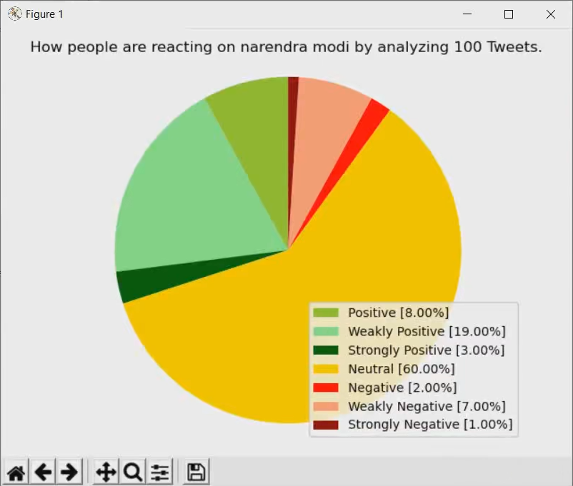
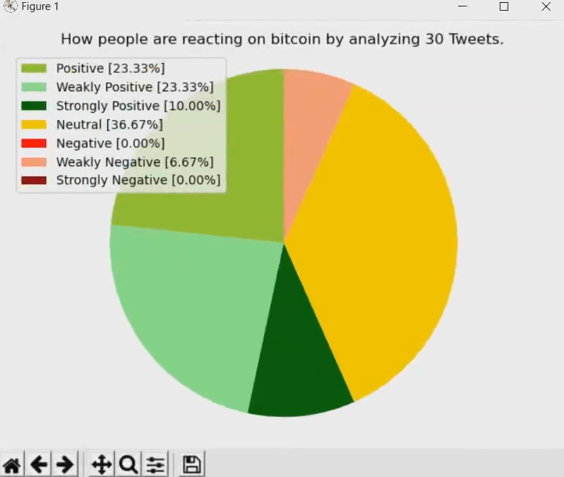

# Twitter-Sentiment-Analysis

This script can tell you the sentiments of people regarding to any events happening in the world by analyzing tweets related to that event. It will search for tweets about any topic and analyze each tweet to see how positive or negative it's emotion is. You might want to check out this complete text and video based detailed [tutorial link](https://github.com/shubhamdhameliya2808/sentimental-analysis-on-tweeter-data/)


## Getting Started
 
First of all login from your Twitter account and goto [Twitter Apps](https://apps.twitter.com/). Create a new app ([How to create twitter app](https://github.com/shubhamdhameliya2808/sentimental-analysis-on-tweeter-data/)) and goto __Keys and access tokens__ and copy Consumer Key, Consumer Secret, Access Token and Access Token Secret. We will need them later. 

### Installation

Download or Clone the repo, Navigate to the directory containing the files and run
```
python setup.py install
```
or if you have different versions of python installed then
```
python3 setup.py install 
```
to install the dependencies.


### Usage

Once you have created an app on twitter and installed all the dependencies by running __setup.py__, open main.py and paste your Consumer Key, Consumer Secret, Access Token and Access Token Secret. After that save and run the script. You will be prompted to enter the keyword/hashtag you want to analyze and the number of tweets you want to analyze. Once the analysis is completed, a pie chart will be generated disclosing the results of analysis.

## Built With

* Python 3.6
* tweepy
* textblob
* matplotlib


## How to perform twitter sentiment Analysis:

### Twitter Sentiment Analysis Python:

Analysis of Twitter Sentiment using Python can be done through popular Python libraries like Tweepy and TextBlob.

### Tweepy: 

Tweepy, the Python client for the official Twitter API supports accessing Twitter via Basic Authentication and the newer method, OAuth. Twitter has stopped accepting Basic Authentication so OAuth is now the only way to use the Twitter API.
Tweety gives access to the well documented Twitter API. Tweepy makes it possible to get an object and use any method that the official Twitter API offers. The main Model classes in the Twitter API are Tweets, Users, Entities, and Places. Access to each returns a JSON-formatted response and traversing through information is very easy in Python.

### TextBlob: 

TextBlob, one of the popular Python libraries for processing textual data, stands on the NLTK. It works as a framework for almost all necessary tasks, we need in Basic NLP (Natural Language Processing). TextBlob has some advanced features like –
Sentiment Extraction
Spelling Correction
TextBlob is useful for Twitter Sentiment Analysis Python in the following ways:

### Tokenization:

TextBlob can tokenize the text blocks into different sentences and words. This makes reading between the lines much easier.


### Noun Phrases Extraction using TextBlob:
The noun is mostly used as an Entity in sentences. It is also one the most important NLP utility in Dependency Parsing. This is how different nouns are extracted from a sentence using TextBlob –

### Part-of-Speech Tagging using TextBlob:

TextBlob is also used for tagging parts of speech with your sentences. For example –

 

 
### N-Grams with TextBlob:

Here N is basically a number. N-Gram is basically a chunk of words in the group. For a deep understanding of N-Gram, we may consider the following example-



## Classifying Sentiments :



## Working Process:
                                                                                                                  
In this project, first I have collected the data and stored them in a file then read the data from the file and word tokenized them using python’s Natural Language Toolkit Library(nltk). There is a list available of positive and negative words on internet that will have all the negative or positive words, stored the words in the dataframe and then compared words of my tweets with the respective words in positive and negative dataframes and generated net positive score and negative score for each( I have collected 200 tweets(as twitter maximum limit is 200 tweets at a time) about ‘Narendra Modi’ and ‘Arvind Kejriwal’ and then analyzing them and displaying the final result in a pie chart to determine whether people are speaking about whom Narendra Modi or Arvind Kejriwal ).


## Expected output:

### output 1:


### output 2:



## Authors

shubham dhameliya                                                                                                                      Manan Gadhiya                                                                                                                           Kapil Kapuriya

## License

This project is licensed under the MIT License - see the [LICENSE.md](https://github.com/shubhamdhameliya2808/sentimental-analysis-on-tweeter-data/tree/master/License.txt) file for details

